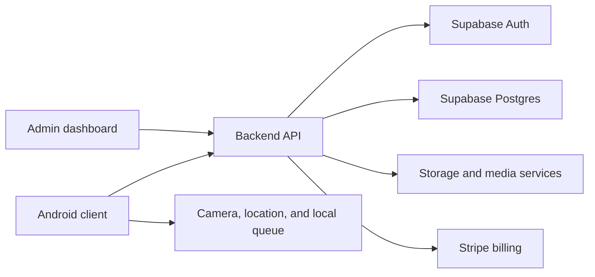
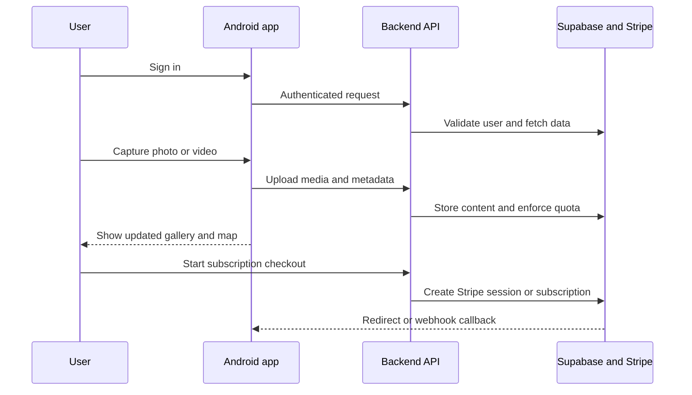

# Lumi 

Lumi is a full-stack media platform made of two main parts:

- the backend service in the lumi-backend folder
- the Android client in the lumi folder

Together, they provide a photo and video gallery experience with account authentication, album management, location-aware media viewing, quota enforcement, and Stripe-based subscription billing.

## Project purpose

The platform is designed for users to:

- create and manage personal media collections
- upload photographs and videos from a mobile app
- organize content into albums
- browse media by gallery and map view
- protect storage usage with quota checks
- manage subscription plans and billing through Stripe
- access admin tools for protected operational workflows

## System architecture



## Repository structure

```text
/
├── lumi-backend/
│   ├── app/
│   ├── actions/
│   ├── components/
│   ├── docs/
│   ├── hooks/
│   ├── lib/
│   ├── supabase/
│   ├── middleware.ts
│   ├── package.json
│   ├── README.md
│   └── ...
├── lumi/
│   ├── app/
│   ├── gradle/
│   ├── app/src/main/java/com/example/lumi/
│   ├── build.gradle
│   ├── README.md
│   └── ...
├── README.md
└── ...
```

## Backend component

The backend lives in the lumi-backend folder and acts as the service layer for the product. It handles:

- authenticated API routes
- media upload and listing flows
- storage quota logic
- Stripe checkout and recurring subscription management
- admin controls and protected endpoints
- metadata and billing synchronization with Supabase and Stripe

The backend is built with Next.js and uses App Router routes under app/api/v1.

## Android client component

The Android app lives in the lumi folder and acts as the mobile front end. It handles:

- user sign-in and session persistence
- camera capture for photos and videos
- local queue management for uploads
- gallery browsing and media viewer flows
- map-based photo location exploration
- billing callback handling after checkout redirects

The app is built as an Android Java project using Gradle and Android Studio.

## Core workflow



## Relationships between the projects

The two parts work together as a connected system:

- the mobile app captures and displays memory content
- the backend verifies identity and ownership
- the backend owns quotas, storage accounting, and subscription state
- Stripe provides billing confirmation and recurring subscription lifecycle events
- Supabase provides the user auth and data foundation for the service layer

## Important notes

This is a multi-service project in transition. The documentation in the backend folder reflects the planned Supabase-first architecture while also containing notes about legacy storage and billing migration steps. The Android app is the consumer-facing product layer that calls into that backend and displays its data.

## Main references

- [lumi-backend/README.md](lumi-backend/README.md)
- [lumi/README.md](lumi/README.md)

## Summary

Lumi combines a secure backend with a camera-first Android client to deliver a media library experience with account management, geotagged media browsing, storage governance, and subscription billing support.
