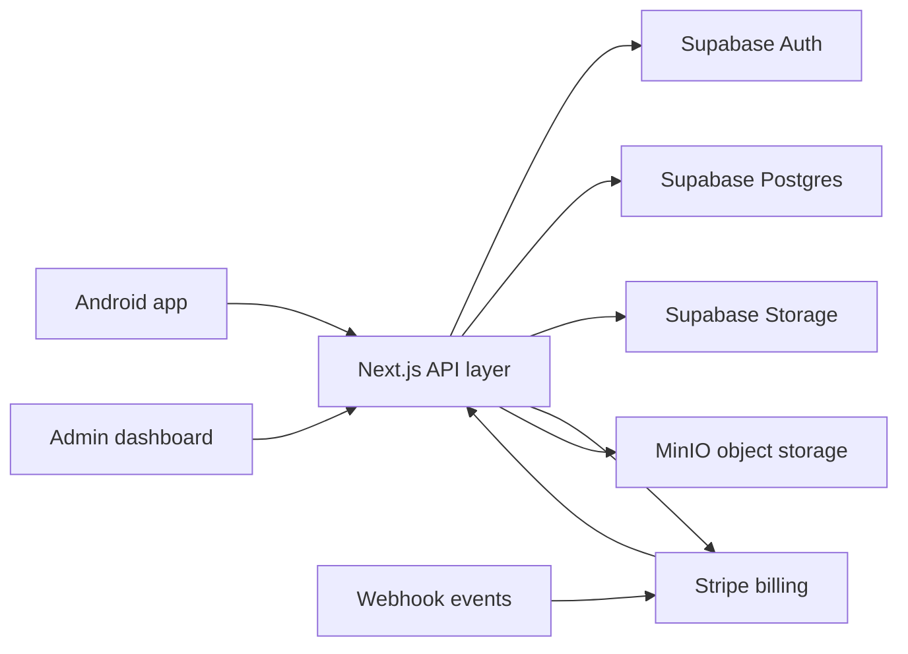
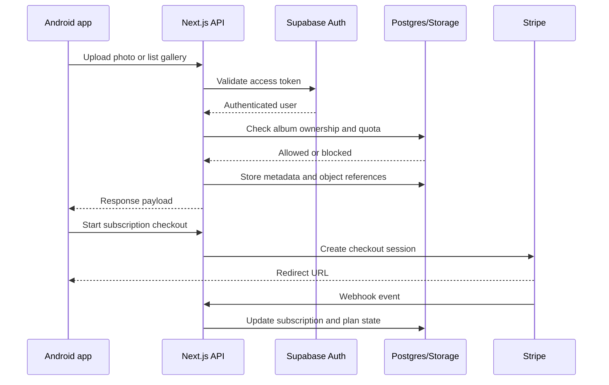

# Lumi Backend

Lumi backend is the service layer for a photo-first memory platform. It authenticates users, manages albums and media metadata, enforces storage quotas, synchronizes billing with Stripe, and exposes admin tooling for operational oversight.

The project is built around the Next.js App Router and uses Supabase for authentication, Postgres, and storage identity, while keeping server-side services like Stripe and object storage integration in the backend layer.

## Project purpose

The platform supports:

- User sign-in and protected API access
- Photo and video uploads with metadata capture
- Album organization and media browsing
- Geotagged location viewing on the Android client
- Storage usage accounting and quota enforcement
- Paid plan activation through Stripe
- Admin visibility for health, plans, and subscription state

This backend is designed to serve both the Android app and an admin interface, while centralizing the rules for ownership, quota checks, and billing state.

## System overview



The actual stack is evolving from a mixed MongoDB and MinIO model toward a Supabase-first foundation, as described in the migration docs under the docs folder. The service layer still contains the legacy transition notes, billing logic, and updated subscription work flows.

## Core architecture

### 1. API layer
The application is organized in the App Router under app/api/v1. The main groups are:

- admin
- albums
- billing
- payments
- photos
- plans
- profile
- subscription
- usage
- webhooks

These routes handle authenticated user requests, Axios or server-side logic, quota enforcement, and Stripe webhooks.

### 2. Business logic layer
The project keeps the business rules in the actions and lib folders:

- actions/ contains domain operations for albums, photos, notifications, search, sharing, scheduled tasks, resource storage, and user actions.
- lib/ contains shared server code, including admin access helpers, billing integration, constants, Stripe wrapper logic, and Supabase helpers.
- app/api routes call these services and avoid embedding business logic directly in the request handlers.

### 3. Data and storage
The project depends on several persistence concerns:

- Supabase Auth and Postgres for user identity, plans, quotas, and subscription records
- Supabase Storage or private object storage for uploaded media
- Stripe for recurring billing and checkout webhooks
- MinIO in the local or transitional stack for media object storage
- MongoDB data remnants and migration planning still appear in the documentation and legacy implementation notes

## Repository structure

```text
lumi-backend/
├── app/
│   ├── admin/
│   ├── api/
│   ├── globals.css
│   ├── layout.tsx
│   ├── login/
│   └── page.tsx
├── actions/
│   ├── albums/
│   ├── minio/
│   ├── notifications/
│   ├── photos/
│   ├── scheduled/
│   ├── search/
│   ├── sharing/
│   ├── storage/
│   └── user-actions.ts
├── components/
│   └── ProtectedRoute.tsx
├── docs/
│   ├── ADMIN_AUTH_QUICK_REFERENCE.md
│   ├── AUTH_SETUP.md
│   └── SUPABASE.md
├── hooks/
│   └── useAdminAuth.ts
├── lib/
│   ├── admin-api.ts
│   ├── admin-guard.ts
│   ├── auth/
│   ├── billing.ts
│   ├── consts.ts
│   ├── stripe.ts
│   └── supabase/
├── supabase/
│   ├── config.toml
│   └── migrations/
├── middleware.ts
├── next.config.ts
├── package.json
├── tsconfig.json
├── docker-compose.yml
├── data.txt
├── serviceAccountKey.json
├── .env.example
└── README.md
```

## Key capabilities

### Authentication and authorization
The system is designed to support both user and admin flows:

- User sessions are validated against Supabase Auth or the active authentication layer
- Admin access is protected by middleware and hooks
- Protected routes can redirect unauthenticated users to the login screen
- Billing and quota routes validate the active authenticated user before state changes

### Media workflows
The backend supports a media stack that includes:

- Uploads for image and video content
- Album association and ownership checks
- File metadata persistence
- Download and preview routes
- Storage accounting and cleanup logic

### Billing and quotas
Subscription logic is central to the platform. The backend includes plan and usage tracking, Stripe customer creation, and webhook-driven subscription lifecycle updates. The main strategy is to treat Stripe as the source of truth for recurring billing state and to update the local entitlement only after verified webhook confirmation.

### Search and sharing features
The actions folders include support for search, notifications, and sharing flows. These modules are meant to extend the core gallery functionality with discoverability and content-sharing features.

## Request flow



## Environment and setup

1. Install dependencies

```bash
npm install
```

2. Create environment variables from .env.example

```bash
cp .env.example .env.local
```

3. Configure the values required for your deployment

- Supabase URL and keys
- Stripe secret key
- Stripe webhook secret
- Storage bucket configuration
- Admin authentication values if admin routes are enabled

4. Run the app locally

```bash
npm run dev
```

The backend runs as a Next.js app and exposes local routes on the standard development port, typically localhost:3000.

## Development notes

### Local Stripe testing
The project documentation points to Stripe webhook testing for the subscription lifecycle. In test mode, the backend should receive events on the route shown below:

```text
https://<public-backend-host>/api/v1/webhooks/stripe
```

Local forwarding with the Stripe CLI is the expected test setup.

### Admin access
The project includes admin login patterns, middleware protections, and admin API helpers. These files are set up to protect dashboard flows and service-level routes.

### Storage migration work
The docs folder explains the migration from legacy MongoDB and MinIO patterns to Supabase-based relational storage and auth. This is important context because parts of the project still reflect a transitional state instead of a fully simplified final state.

## Primary backend modules

### app/api/v1/photos
Handles the upload, preview, listing, and storage enforcement flows for photos and videos.

### app/api/v1/subscription
Covers current subscription state, billing status, and plan visibility.

### app/api/v1/billing
Creates checkout and portal flows for Stripe-based billing operations.

### app/api/v1/webhooks
Processes Stripe events and synchronizes local billing state.

### app/api/v1/admin
Protects operational dashboards and privileged API access.

### lib/billing.ts and lib/stripe.ts
Provide Stripe helpers for customer creation, plan validation, and billing metadata operations.

### supabase/migrations
Stores the database schema and deployment changes used for auth, billing, quota tracking, and user storage records.

## Security and operational principles

- Validate user identity from trusted auth context before allowing changes
- Treat Stripe as the source of truth for subscription lifecycle events
- Enforce quota accounting transactionally
- Keep service-role credentials on the server only
- Avoid trusting client-provided billing or ownership values
- Reconcile failed or duplicate webhook events safely

## Official references

- https://nextjs.org/docs
- https://supabase.com/docs
- https://stripe.com/docs/webhooks
- https://developer.android.com/guide

## Summary

Lumi backend is a service-centric platform that sits between the Android client, Supabase infrastructure, and Stripe billing. Its core responsibilities are identity, media ownership, storage quota enforcement, subscription logic, and operational admin access. The codebase is structured to support secure user experiences and a controlled transition to the Supabase-first architecture described in the migration docs.

