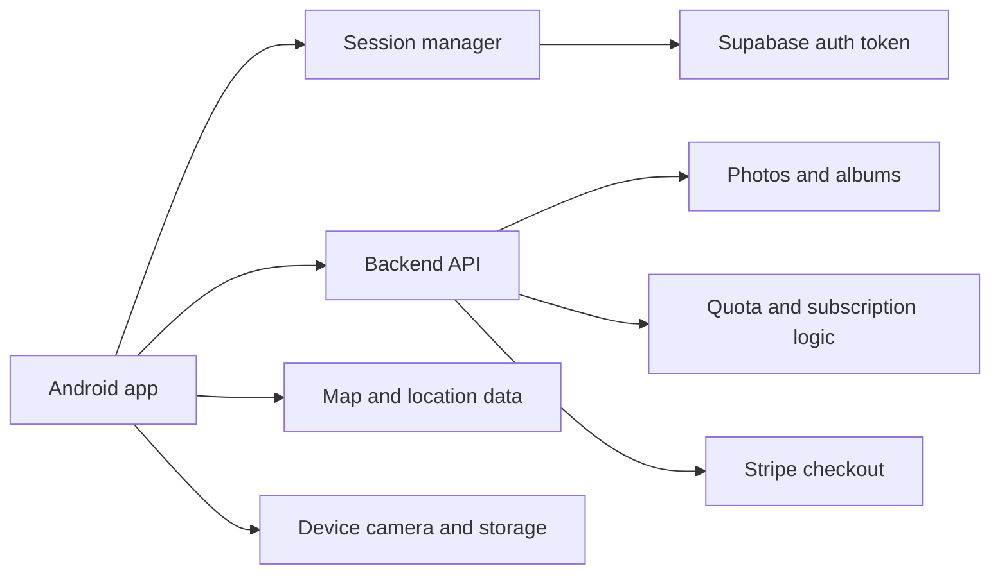
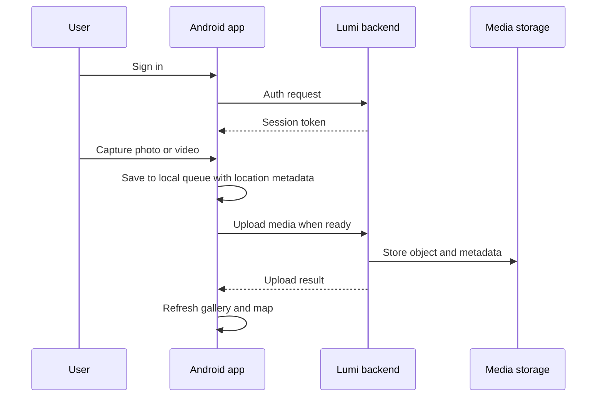

# Lumi Android client

Lumi Android is the mobile client for a photo-first, geotagged memory platform. It lets users sign in, capture photos and videos, organize them into albums, browse a gallery, view media on a map, and complete billing-related redirects from the backend subscription flow.

The app is implemented as an Android Java project and connects to the Lumi backend through authenticated API requests and token-based session management.

## Project purpose

The client supports the following user journeys:

- Create an account and sign in securely
- Capture photos and videos with device camera access
- Attach current location metadata to captured media
- Browse recent uploads in a gallery view
- Open media in a dedicated viewer activity
- Review a map view of photo locations
- Manage billing return flows after a backend checkout success or cancel action
- Interact with a backend API that handles quotas and subscriptions

In short, this app is the front end for a personal memory and media library where location, upload state, and subscription flows are part of the product experience.

## System overview



The app uses the device camera, local temporary files, permission handling, and a queue-based upload approach. Uploads are triggered after capture, and the app keeps working even when network conditions are imperfect by storing queued work locally before sending it to the backend.

## Architecture of the Android project

### Activities
The main application flow starts from the sign-in and main app screens:

- activities.SignIn
- activities.SignUp
- activities.MainActivity
- activities.PhotoViewerActivity

These classes handle authentication, app navigation, the gallery viewer, and the billing callback route from the backend.

### Fragments
The interface is split into primary screens:

- fragments.HomeFragment
- fragments.AlbumsFragment
- fragments.MapFragment
- fragments.SettingsFragment
- fragments.ChangePlanFragment

The home screen is the primary library and upload area. The map screen shows a geographic view of media based on captured coordinates. Settings and billing screens manage configuration and plan changes.

### Core libraries and helpers
The lib package contains reusable platform logic:

- API.java for backend requests
- SessionManager.java for signed-in state
- SupabaseAuth.java for auth integration
- UploadQueueStore.java for queued uploads
- Toast.java and ToastManager.java for feedback messages

### Models
The model layer defines the data structures used across the app:

- Album.java
- GalleryDay.java
- Image.java
- ImageMetaData.java
- Plan.java
- QueuedUploadItem.java

### Workers and background behavior
The workers package contains background upload processing so captures can complete even after the app is not actively visible.

## Repository structure

```text
lumi/
├── app/
│   ├── build.gradle
│   ├── src/
│   │   ├── main/
│   │   │   ├── AndroidManifest.xml
│   │   │   ├── java/com/example/lumi/
│   │   │   │   ├── activities/
│   │   │   │   ├── adapters/
│   │   │   │   ├── controllers/
│   │   │   │   ├── fragments/
│   │   │   │   ├── lib/
│   │   │   │   ├── models/
│   │   │   │   ├── views/
│   │   │   │   └── workers/
│   │   │   └── res/
│   │   └── androidTest/
├── build.gradle
├── gradlew
├── gradlew.bat
├── gradle/
├── settings.gradle
├── .env.example
├── .gitignore
├── README.md
└── README_TOAST.md
```

## Key capabilities in the client

### Camera capture flow
The HomeFragment uses the Android camera APIs and file provider to capture photos and videos. After capture, each item is assigned a timestamp and the user location if permission is available.

### Gallery and media viewer
Images and videos are displayed in a grid and can be opened in the PhotoViewerActivity. The app merges remote API items with locally queued uploads to show a unified, current gallery view.

### Location-aware browsing
The map fragment fetches photo metadata from the backend and places markers on an OpenStreetMap view. This allows users to browse content by where it was captured.

### Session-aware API access
The app stores user session information and includes the access token in authenticated requests. API calls are performed against the backend routes for photos, albums, subscription state, and usage data.

### Billing callback handling
The app listens for deep links in the manifest using the lumi://billing scheme. A successful or canceled billing flow updates the UI with a toast message after the user returns from Stripe checkout.

## Build and run

1. Open the project in Android Studio.
2. Make sure the Android SDK and Gradle wrapper are available.
3. Add your environment values in the local project environment, including:

```text
SUPABASE_URL
SUPABASE_PUBLISHABLE_KEY
API_BASE_URL
```

4. Sync Gradle and build the project.

```bash
./gradlew assembleDebug
```

5. Run the app on an emulator or connected device.

## App flow



## Important implementation details

### Permissions
The app requests camera and location permissions before allowing capture. This is essential because media is geotagged and the app expects user location to be available for map-based viewing.

### Local queue management
Photos and videos are queued before upload and revisited on app start or resume. This helps the app remain resilient during intermittent connectivity problems.

### Network access
The Android manifest includes internet and location permissions, and the app config includes a network security configuration for backend communication.

## External references

- https://developer.android.com/studio
- https://supabase.com/docs
- Leaflet 1.9.4 with OpenStreetMap tiles is used for the in-app photo map.
- https://stripe.com/docs/payments/checkout

## Notes for maintainers

The Android client uses Supabase Auth and Supabase Realtime for identity and in-app broadcast notifications. The backend manages identity, media, storage limits, subscription billing, and notification history.

## Summary

Lumi Android is the front-end layer for a memory capture and media library product. It focuses on camera-first usage, geotagging, gallery browsing, map-based discovery, and integration with the Lumi backend for safe media storage and subscription-aware account behavior.
